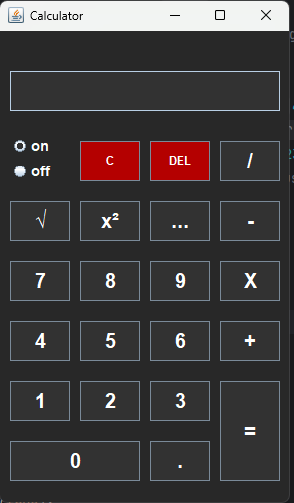

<h1 align="center">🧮 Kalkulator Sederhana dengan Java Swing</h1> 

<p align="center">
  <a href="https://calculator.com" target="_blank">
    
  </a>
</p>


## Deskripsi ✨

Selamat datang di proyek Kalkulator Sederhana! Kalkulator ini dibangun menggunakan Java Swing untuk memberikan pengalaman kalkulator yang intuitif dan mudah digunakan.

Dengan desain yang modern dan fungsionalitas yang handal, kalkulator ini siap membantu Anda dalam melakukan perhitungan sehari-hari. 🚀

## Fitur Unggulan 🚀

* **Antarmuka yang Menawan:**  Nikmati tampilan kalkulator yang modern dan elegan dengan kombinasi warna abu-abu gelap, abu-abu terang, dan aksen kuning yang menawan.  🎨
* **Tombol yang Intuitif:** Tombol-tombol dirancang dengan ukuran besar dan label yang jelas, memastikan pengalaman penggunaan yang nyaman dan mudah dinavigasi. 🖱️
* **Operasi Matematika Esensial:** Lakukan perhitungan dasar dengan mudah, meliputi:
    * Penjumlahan ➕
    * Pengurangan ➖
    * Perkalian ✖️
    * Pembagian ➗
* **Fungsi Tambahan:**  Kalkulator ini juga dilengkapi dengan fungsi-fungsi yang bermanfaat seperti:
    * Akar Kuadrat (√)
    * Pangkat Dua (x²)
    * Kebalikan (1/x)
* **Kemudahan Penggunaan:**  Kalkulator ini dirancang dengan mengedepankan  kesederhanaan, sehingga siapa pun dapat langsung menggunakannya tanpa kesulitan. 😄

## Cara Menjalankan Aplikasi 🏃‍♀️

1. **Prasyarat:** Pastikan Anda telah menginstal Java Development Kit (JDK) pada sistem Anda.
2. **Clone Repositori:** Lakukan clone repositori ini ke komputer lokal Anda.
   ```bash
   git clone https://github.com/hendrowunga/Calculator_Application.git
   ```
3. **Buka Project:** Buka project dengan IDE yang Anda gunakan, misalnya NetBeans, IntelliJ IDEA, Eclipse.
4. **Jalankan Aplikasi:** Jalankan aplikasi dengan menekan tombol "Run" di IDE Anda. 